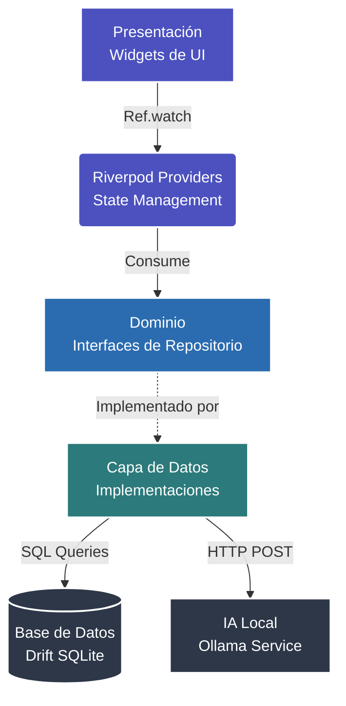

# WalletFY 💰
> **Ahorro que Inspira. Crecimiento Claro.**

WalletFY es una aplicación de escritorio multiplataforma construida con **Flutter** que revoluciona la gestión de ahorros personales. Combinando una interfaz *Premium Glassmorphism*, analíticas avanzadas, un sistema de gamificación basado en rachas y un **asesor financiero de Inteligencia Artificial (IA)** ejecutándose 100% en local.

## 📱 Galería de la Interfaz

La aplicación cuenta con una estética inmersiva "Glassmorphism" con colores dinámicos HSL que se adaptan a las preferencias del usuario, fondos animados y componentes de cristal esmerilado.

| Dashboard | Metas | Analíticas |
|:---:|:---:|:---:|
|  |  |  |

| Perfil | IA Chat | Detalles de Meta |
|:---:|:---:|:---:|
|  |  |  |

## ✨ Características Principales

*   **🎯 Gestión de Metas**: Planes de ahorro múltiples, personalizados con emojis, colores dinámicos y fechas límite.
*   **🔥 Sistema de Rachas Inteligente**: Gamificación que premia el ahorro diario con mecánicas de gracia (posibilidad de "congelar" rachas y recuperación ante tropiezos).
*   **📊 Analíticas Completas**: Gráficos interactivos de barras, líneas y donas construidos con `fl_chart` para visualizar el progreso y hábitos financieros.
*   **🤖 IA Financiera Integrada (Local)**: Integración con **Ollama** vía REST (Dio) para chatear con un LLM local (ej. Llama 3) de manera completamente privada y offline.
*   **🌙 Temas Dinámicos HSL**: Motor de temas personalizado que genera paletas de colores ricas y profundas basándose en la selección del usuario, con soporte completo para Modo Oscuro/Claro.
*   **🔒 Privacidad First**: Arquitectura "Local-First" utilizando SQLite (Drift). Tus datos financieros nunca abandonan tu dispositivo.

## 🏗 Vista General de Arquitectura

WalletFY implementa **Clean Architecture** estructurada por capas, garantizando la separación de responsabilidades y facilitando el testing y mantenimiento. El estado de la aplicación se maneja con **Riverpod**, logrando una UI completamente reactiva.



> **Para más detalles sobre la arquitectura, consulta nuestra [Documentación de Arquitectura](docs/files/architecture.md)**.

## 🛠 Stack Tecnológico

| Capa | Tecnología | Descripción |
|------|-----------|-------------|
| **Framework** | Flutter 3.x | Aplicación compilada nativamente (Desktop: Windows/macOS/Linux) |
| **Estado** | Riverpod 2 | `riverpod_generator` y Providers reactivos asíncronos (`AsyncValue`) |
| **Persistencia** | Drift (SQLite) | ORM Type-Safe reactivo para operaciones transaccionales locales |
| **Red** | Dio | Cliente HTTP para la comunicación con la API REST de Ollama |
| **Visualización**| fl_chart | Gráficos matemáticos personalizables y fluidos |
| **UI/UX** | flutter_animate | Animaciones declarativas, micro-interacciones y UI en cascada |

## 🚀 Inicio Rápido

### Requisitos Previos
1. SDK de [Flutter](https://flutter.dev) instalado (versión 3.19 o superior recomendada).
2. [Ollama](https://ollama.ai) instalado para la funcionalidad de IA.

### Configuración y Compilación
```bash
# 1. Obtener dependencias
flutter pub get

# 2. Generar código autogenerado (Drift y Riverpod)
dart run build_runner build --delete-conflicting-outputs

# 3. Compilar y ejecutar la aplicación (ej. en Windows)
flutter run -d windows
```

## 🤖 Configuración de la Inteligencia Artificial (Ollama)

WalletFY utiliza modelos de lenguaje (LLMs) ejecutados en tu propio hardware para máxima privacidad.

1. Instala y ejecuta **Ollama**.
2. Descarga un modelo en tu terminal: `ollama run llama3` (o `mistral`).
3. Abre **WalletFY**, ve a **Perfil** > **Configuración IA** y asegúrate de que la URL apunte al puerto correcto (por defecto `http://127.0.0.1:11434`) y el nombre del modelo coincida.

> **Para más detalles sobre la integración de IA, consulta la [Documentación de IA](docs/files/ai_integration.md)**.

## 📚 Documentación Técnica Adicional

Explora la carpeta `docs/files/` para guías exhaustivas:
- 🏗 [Arquitectura Clean y Estado (Riverpod)](docs/files/architecture.md)
- 🗄️ [Base de Datos (Drift) y Modelado](docs/files/database.md)
- 🧠 [Integración y Prompting de IA Local](docs/files/ai_integration.md)

## ⚠️ Descargo de Responsabilidad (Disclaimer)

**WalletFY** es un proyecto de software libre con fines educativos y de uso personal. 
- **Ausencia de Garantía**: El autor no asume ninguna responsabilidad legal, financiera o por pérdida de datos derivados del uso de esta aplicación. Las decisiones financieras tomadas a partir de la información o consejos de la Inteligencia Artificial integrada son responsabilidad exclusiva del usuario.
- **Sin Costos Ocultos**: Esta aplicación no incluye software de pago, suscripciones, ni requiere licencias comerciales para operar. Las herramientas subyacentes (Flutter, Drift, Ollama) son de código abierto.

## 📄 Licencia

Este proyecto está bajo la Licencia **MIT** — Siéntete libre de usarlo, modificarlo y distribuirlo bajo tus propios riesgos.

*Felipe Estrella 2026*
