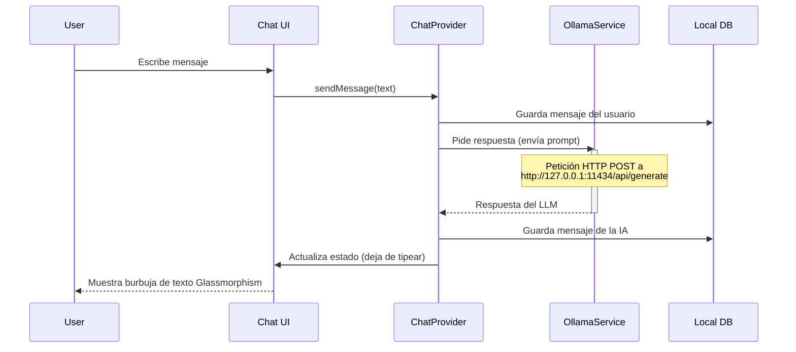

# Integración de IA Local (Ollama)

WalletFY se distingue de otras aplicaciones financieras al ofrecer un asistente financiero de Inteligencia Artificial ("WalletFY AI") que opera **completamente de manera local**. Esto se logra conectando la aplicación con un servidor local de [Ollama](https://ollama.ai/), asegurando que ningún dato financiero sea enviado a la nube.

## Arquitectura de Chat

El servicio de chat funciona como un microservicio interno dentro de la capa Data.



## Configuración y Servicio (`OllamaService`)

La conexión se establece a través del paquete `dio` en el archivo `ollama_service.dart`. 
Por defecto, asume que Ollama está corriendo en `http://127.0.0.1:11434` y utiliza el modelo `llama3`. Ambos parámetros pueden ser modificados por el usuario desde la pantalla de Perfil.

### Petición a la API de Ollama
WalletFY hace un `POST /api/generate` con el siguiente payload JSON en crudo:

```json
{
  "model": "llama3",
  "prompt": "El mensaje inyectado con el contexto financiero...",
  "stream": false
}
```

## Ingeniería de Prompts (Prompt Engineering)

Para que el modelo local entienda que no es un asistente genérico sino un asesor financiero llamado WalletFY AI, se le inyecta un *System Prompt* dinámico en `chat_repository_impl.dart`.

### Estructura del Contexto Inyectado
Antes de enviar la consulta del usuario a Ollama, el repositorio recopila el contexto financiero actual de la base de datos de Drift y lo añade oculto en el prompt:

1. **Datos de Metas Activas**: Monto actual, objetivo y nombre de cada meta.
2. **Contexto Temporal**: Fecha actual para que la IA sepa situarse en el tiempo.
3. **Instrucciones de Personalidad**: "Eres WalletFY AI, un asesor financiero empático y profesional..."
4. **Instrucciones de Formato**: "Responde con formato Markdown corto y conciso... no uses más de 3 párrafos cortos."

### Ejemplo del Prompt Compilado

```text
Eres WalletFY AI, un asesor financiero integrado en la app WalletFY.
Responde de forma concisa, amigable, usando Markdown y emojis. No saludes cada vez.
Aquí están los datos del usuario:
Meta: Viaje a Puerto Escondido | Ahorrado: $500.00 / $12,000.00
No compartas estos datos crudos, úsalos para aconsejar.

Usuario: ¿Cómo voy con mi meta principal?
```

## Manejo de Errores y Caídas

Si el servicio local de Ollama no está ejecutándose o no se ha descargado el modelo especificado, la interfaz de Chat (`ChatPage`) mostrará un estado reactivo:
- El indicador de la esquina superior pasará de "Conectado" (verde) a "Sin conexión" (rojo).
- Un Banner de error flotante aparecerá informando al usuario que debe levantar el servidor local de Ollama.
- El campo de texto se deshabilitará para evitar consultas bloqueantes inútiles.
