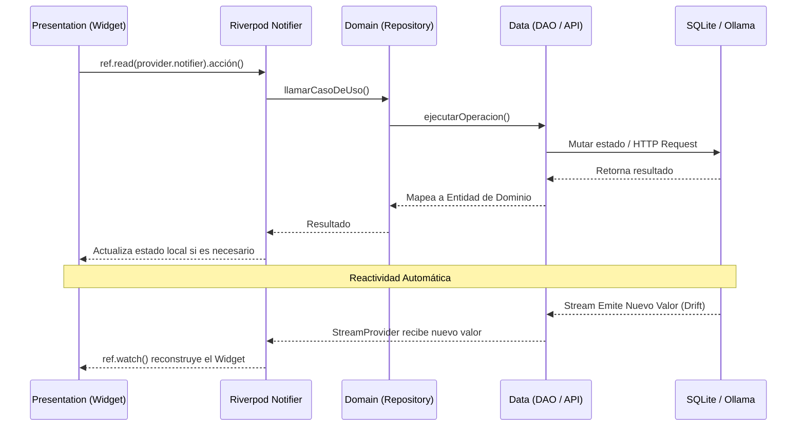

# Arquitectura de WalletFY

WalletFY implementa una variación pragmática de **Clean Architecture**, optimizada para el framework de Flutter y combinada fuertemente con el gestor de estado **Riverpod**. El objetivo es aislar la lógica de negocio, las fuentes de datos locales/externas y la capa de interfaz de usuario.

## Estructura de Directorios

La estructura bajo la carpeta `lib/` refleja esta separación de responsabilidades:

```text
lib/
├── core/
│   ├── constants/         # Textos estáticos, citas motivacionales.
│   ├── error/             # Manejo global de excepciones.
│   ├── theme/             # Lógica de ColorScheme dinámica (AppTheme).
│   └── utils/             # Formateadores (Fecha, Moneda).
├── data/
│   ├── database/          # Configuración principal de Drift SQLite.
│   │   └── daos/          # Data Access Objects (GoalDao, TransactionDao).
│   ├── models/            # Modelos exclusivos de capa de datos (si aplican).
│   └── repositories/      # Implementaciones concretas de los repositorios.
├── domain/
│   ├── entities/          # Clases planas de negocio (Entities/POJOs).
│   └── repositories/      # Interfaces (Contratos) que la capa Data debe cumplir.
└── presentation/
    ├── pages/             # Vistas de pantallas completas por feature.
    ├── providers/         # Estado de Riverpod (Notifiers y Streams).
    └── widgets/           # Componentes reusables (PremiumGlassWidgets).
```

## Flujo de Datos y Reactividad

El corazón de WalletFY es la reactividad unidireccional proporcionada por **Riverpod** y **Drift**.



### 1. La Capa de Dominio (Domain)
Define el "qué" hace la aplicación, no el "cómo". Contiene las **Entities** puras en Dart que no dependen ni de Flutter, ni de bases de datos de terceros. Aquí definimos las **Interfaces de Repositorio** (ej. `GoalRepository`) que declaran qué operaciones deben ser posibles (crear meta, archivar meta).

### 2. La Capa de Datos (Data)
Implementa el "cómo". Aquí se encuentra `goal_repository_impl.dart`, el cual implementa `GoalRepository`. Toma los datos de Drift (DAO), los formatea y los transforma en las Entidades de Dominio antes de devolverlos. Esto nos asegura que la UI no conozca la existencia de Drift.

### 3. La Capa de Presentación (Presentation)
Depende exclusivamente de **Riverpod** y el **Domain**. Los Widgets hacen un `ref.watch()` de los `StreamProviders`.

#### El Patrón Riverpod `StreamProvider`
Dado que usamos Drift, la mayoría del estado central fluye a través de Streams persistentes. Cuando la base de datos cambia (al abonar a una meta), el DAO de Drift empuja automáticamente un nuevo evento por el Stream. Riverpod captura este cambio en su `StreamProvider`, notifica a los Widgets que dependen de él (`ref.watch`) y redibuja la pantalla con las animaciones de cascada. Esto elimina la necesidad de recargar los datos manualmente.
