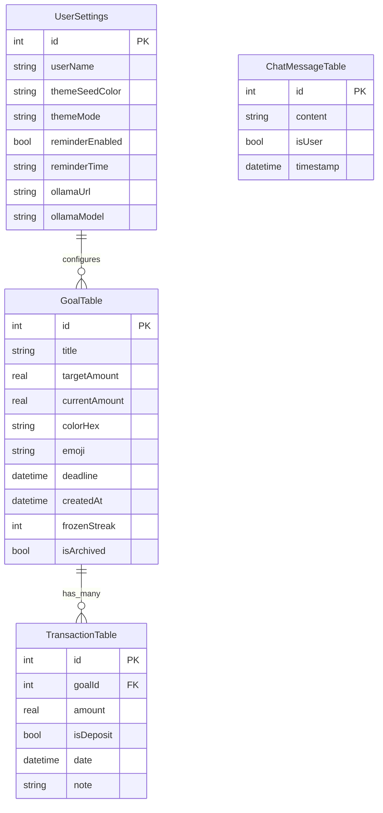

# Persistencia y Base de Datos (Drift)

WalletFY es una aplicación con enfoque "Privacy First". Toda la información financiera del usuario se procesa y almacena localmente en el dispositivo utilizando SQLite. Para interactuar con SQLite de manera segura, tipada estáticamente y reactiva, utilizamos el ORM **Drift**.

## Esquema Relacional

El modelo de datos relacional de la aplicación se divide en cuatro tablas principales:

## Configuración y Setup

La configuración principal de Drift reside en `app_database.dart`. Allí se definen las tablas a compilar y la versión de la base de datos (Migrations).

En Windows, Mac o Linux, la base de datos se guarda en un archivo físico manejado por `path_provider` (normalmente dentro de `%APPDATA%` en Windows o `Application Support` en Mac).

## Patrón Data Access Object (DAO)

Para evitar que `app_database.dart` crezca descontroladamente y contenga toda la lógica, implementamos **DAOs** separados para cada entidad lógica.

### 1. GoalsDao (`goals_dao.dart`)
Se encarga de crear metas, archivar, y actualizar los montos actuales de la tabla `goals`. Su método principal es `watchActiveGoals()`, que retorna un `Stream<List<GoalData>>`.

### 2. TransactionsDao (`transactions_dao.dart`)
Maneja el registro de nuevos depósitos. Una parte fundamental de este DAO es que **emplea transacciones atómicas de base de datos** (`transaction(() async {...})`). Cuando el usuario abona dinero a una meta, el DAO debe:
1. Insertar la nueva fila en la tabla `transactions`.
2. Actualizar el campo `currentAmount` de la tabla `goals` asociada.
Ambas operaciones suceden de manera atómica para evitar inconsistencias financieras.

### 3. UserSettingsDao y ChatDao
Manejan las preferencias de usuario (estado de la UI y configuración de la IA) y el historial completo de mensajes entre el usuario y la Inteligencia Artificial.

## Reactividad Continua

Al usar los métodos `watch...()` que exponen los DAOs de Drift, la interfaz de usuario de Flutter a través de Riverpod reacciona en tiempo real a cada INSERT o UPDATE. Esto significa que si agregas un depósito en el *Dashboard*, la pantalla de *Metas* y el *Perfil* se actualizarán automáticamente sin necesidad de recargar la información de manera manual.
